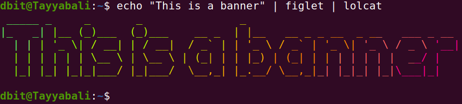
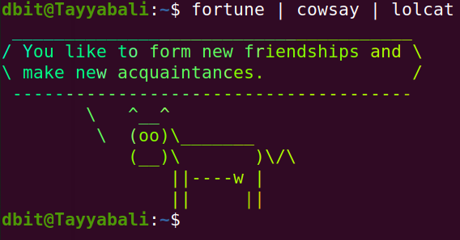
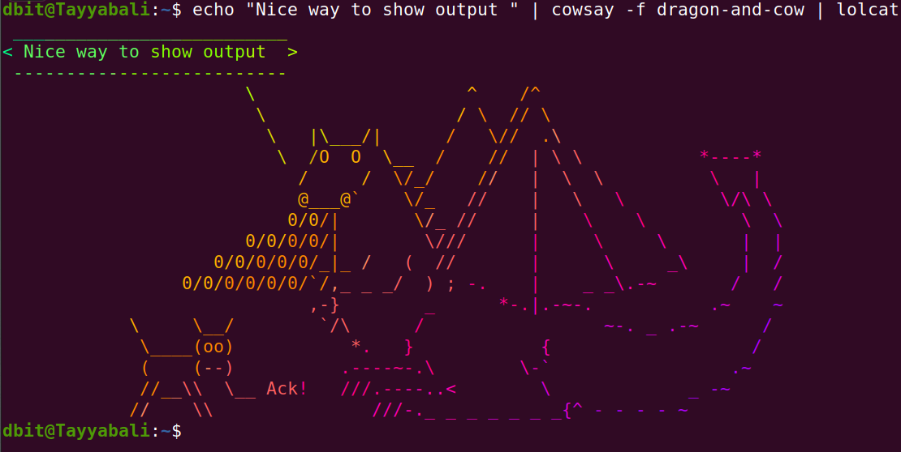

Execution of Unix General Purpose Utility Commands

Comand line is the primary and mostly used way to interact with the Linux systems

We use 

### echo Command 

echo command in unix is used to display text on screen. echo is also used for other purposes like creating file or listing the files from the directory and displaying the value of the variables. 

Some of the examples of the echo commands are as follows.

$ command -options 

the ```$``` is the default command line prompt which says its a normal user session.

if you switch to the root user it will change to ```#```

```
echo hi
echo "Hello"
a = 10
echo $a
```
We define variable a and assign value 10 to it. Using echo then wee can display its value.

### Fun with command line 

You can install some of the command line output formatting tools like cowsay, figlet etc and decorate the output in very unique and fun way.

Install these tools on ubuntu using following commands

```
$ sudo apt install cowsay
$ sudo apt install fortune
$ sudo apt install figlet
$ sudo apt install lolcat
```

You can then try following examples and try with different options

```
dbit@Tayyabali:~$ cowsay Hello
 _______
< Hello >
 -------
        \   ^__^
         \  (oo)\_______
            (__)\       )\/\
                ||----w |
                ||     ||

```

Cowsay basically generates  an ASCII picture of a cow saying something provided by the user as shown above.

```
dbit@Tayyabali:~$ fortune 
Q:	Why is Christmas just like a day at the office?
A:	You do all of the work and the fat guy in the suit
	gets all the credit.

dbit@Tayyabali:~$ fortune 
Tempt not a desperate man.
		-- William Shakespeare, "Romeo and Juliet"

```

fortune will basically give you anything random text from the files , which is fun and interesting to read

```
dbit@Tayyabali:~$ figlet DBIT
 ____  ____ ___ _____ 
|  _ \| __ )_ _|_   _|
| | | |  _ \| |  | |  
| |_| | |_) | |  | |  
|____/|____/___| |_|  

```

Figlet will display the given text into large text which is made out of other screen characters.


```
echo Hello | lolcat 
Hello
```
lolcat will display the text in rainbow colors. 

Here in the above example we are passing the output of the echo command to the lolcat to display in rainbow colors

You can try following examples on your linux system and observer the outputs and play around it.

```
$ echo "This is a banner" | figlet | lolcat
```


```
$ fortune | cowsay | lolcat
```



```
$ echo "Nice way to show output " | cowsay -f dragon-and-cow | lolcat
```



### clear  

Using clear command you can clear the screen content. You can also use Ctl + l to do the same task.


### exit  

`exit` can be used for 

1. to get out of the terminal 

2. to exit from the ssh session 

3. to exit from the user login from the command line 


### date  

Use data in terminal or in shell programming to fetch the date or to calculate arthimatic operations on date

Some of the examples of teh date are given as follows 

```
date
date 2022

```

### uptime

Uptime command gives you information about your system like when it started, how long it is running etc

```
dbit@Tayyabali:~$ uptime
16:13:53 up  7:32,  2 users,  load average: 0.79, 0.41, 0.28

```

As you ca see in the above example, first column shows the curent time, second show hw long the system is running in hrs and minutes, 2 users are logged in and system load for the last 1, 5 and 15 minutes

Use -p to print information in pretty format 

```
dbit@Tayyabali:~$ uptime -p
up 7 hours, 35 minutes
```

To find out when your system started you can use -s option

```
dbit@Tayyabali:~$ uptime -s
2022-02-23 08:40:54
```

It shows system started at 23rd Feb 2022 and at 8:40:54 am 


### cal

cal command like date show the entire Calendar 

Execute following commands on your system and check the output


```
dbit@Tayyabali:~$ cal
   February 2022      
Su Mo Tu We Th Fr Sa  
       1  2  3  4  5  
 6  7  8  9 10 11 12  
13 14 15 16 17 18 19  
20 21 22 23 24 25 26  
27 28 
```

only ```cal``` will print curent months calendar 

You can specify month and year or only year also.

```
dbit@Tayyabali:~$ cal  March 2022
     March 2022       
Su Mo Tu We Th Fr Sa  
       1  2  3  4  5  
 6  7  8  9 10 11 12  
13 14 15 16 17 18 19  
20 21 22 23 24 25 26  
27 28 29 30 31
```
### tty

### man

### which

### history

### id

### pwd

### whoami

### ping

### ifconfig

### pr

### lp

### lpr

### lpstat

### lpq

### lprm

### cancel

### mail

