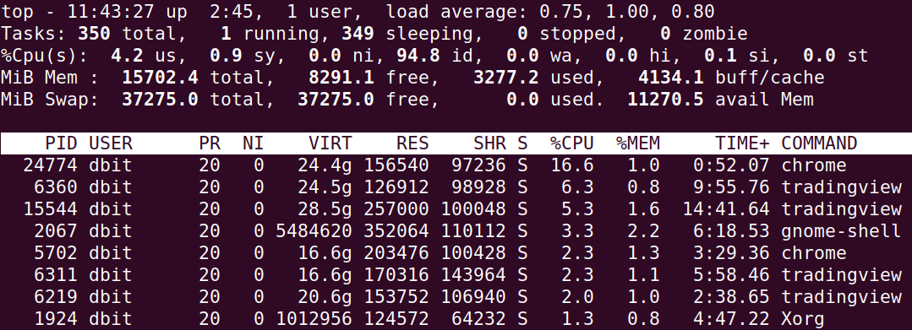
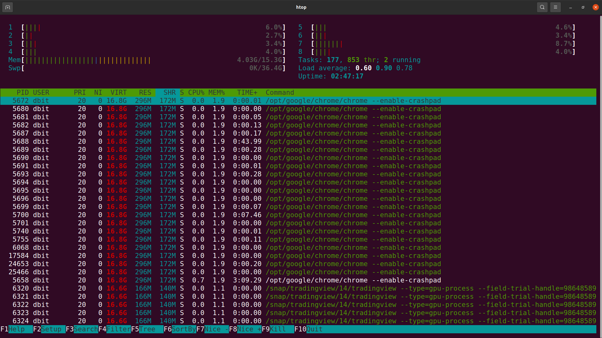

In this lesson you will learn following memory management commands

+ **free**  - To check RAM status 
+ **proc/meminfo** - Detailed RAM status 
+ **top**  - Process Management 
+ **htop** - Advanced Process Management 
+ **df** - Disk Free Space Details 
+ **du** - Disk Consumption Details 
+ **vmstat** - Virtual Memory Statistics 
+ **demidecode** - Systems Hardware Information
+ **sar** - System Activity **Report 
+ **pagesize** - Virtual Page size information 
  

### free command 

Free command is used to find out how much RAM is free and how much is used. It displays physical, swap, cache and buffers status 

you can use following options to customize the display 

- b - to display output in bytes
- k - to display in kilobytes 
- m - to display in mebibytes
- g - to display in gibibytes 

You can also use the -s option to display results for given seconds apart

Example1 : Display memory status in megabtes

```
➜  ~ free -m     
              total        used        free      shared  buff/cache   available
Mem:          15702        3442        8185         970        4073       10965
Swap:         37274           0       37274

```

Meaning of each column 

+ total : Total full available RAM memory size
+ used :  Amount of RAM currently used by the processes
+ free : Free memory i.e. Available - Used 
+ shared : memory used in tmpfs to for creating the virtual memory
+ buff/cache : Memory used by cache and kernel buffers 
+ available : memory available to run more applications 

Example2: Display memory status in every second in gegabytes format

```
$ free -g -s 1

➜  ~ free -g -s 1
              total        used        free      shared  buff/cache   available
Mem:             15           3           8           0           3          10
Swap:            36           0          36

```


## /proc/meminfo 

Under /proc directory we have meminfo file, this file give lot of information about your systems RAM memory.

You can use cat or nano to display the content of this file. Actually this file is created in the memory by OS to give all the information about the system.


Sample output of meminfo file is shown below

```
➜  ~ cat /proc/meminfo 
MemTotal:       16079272 kB
MemFree:         8352544 kB
MemAvailable:   11210548 kB
Buffers:          194212 kB
Cached:          3848588 kB
SwapCached:            0 kB

Active:          1229996 kB
Inactive:        5143856 kB
Active(anon):      17496 kB
Inactive(anon):  3320736 kB
Active(file):    1212500 kB
Inactive(file):  1823120 kB
Unevictable:      768512 kB
Mlocked:              64 kB

SwapTotal:      38169596 kB
SwapFree:       38169596 kB
Dirty:               404 kB
Writeback:           240 kB
AnonPages:       3099708 kB
Mapped:          1117128 kB

. . . 

```

We will not go through all the attributes of the above file, you need to know th concepts of Operating System to understand the menaing of all the attributes.

In this file you will get total RAM size, total swap memory, consumed, free, available to use, memory page mappings, virtual memory allocations, dirty pages, swapped memory etc.

For more information you can visit : https://access.redhat.com/documentation/en-us/red_hat_enterprise_linux/6/html/deployment_guide/s2-proc-meminfo

### top

top is used to display the process running in the system. When you run the top command you get following output



Top displays following information on first few lines 

+ Current time and sinceh when system booted 
+ Total numers of users logged in 
+ system load over 1,5 and 15 min 
+ How many tasks/processes are running and their states 
+ CPU utilization and their categories of usage as shown following 
    + us, user    : time running un-niced user processes
    + sy, system  : time running kernel processes
    + ni, nice    : time running niced user processes
    + id, idle    : time spent in the kernel idle handler
    + wa, IO-wait : time waiting for I/O completion
    + hi : time spent servicing hardware interrupts
    + si : time spent servicing software interrupts
    + st : time stolen from this vm by the hypervisor
+ Physical Memory usage information like total, free, used and buff/cache 
+ Swap memory usage information like total, free, used and avail


As you can see in the output, get following information in the colums

+ PID - Process identifier 
+ USER - User who started or Owner of process 
+ PRI - Process priority for kernel
+ NI - Process priority set by user or root 
+ VIRT - Vrtual memory consumed by process 
+ RES - Physical memory consumed by the process 
+ SHR - Shared memory consumed by the process 
+ S - State of the process 
+ CPU% - % CPU utilization by the process 
+ MEM% - % of Memory consumption by the process 
+ TIME+ - time since the process started the execution 
+ Command - Command path which started the execution of the process 


Process states : 

+  D = uninterruptible sleep
+  I = idle
+  R = running
+  S = sleeping
+  T = stopped by job control signal
+  t = stopped by debugger during trace
+  Z = zombie


### htop



Htop is advanced process monitoring command siliar to top but it gives more advanced interactive features. 

Htop has similar colum out put as top command along with this is shows information about the individual cpu utilizations on top.

You can use the keyboard to do various additional operations like 

+ Use arrow keys to scroll through processes like left, right, home etc
+ Use function keys to search, filter, sort, change priority and kill processes.


### df 
df is stands for disk space, df can se used to find out all about the consumption of the disk space 

Lets see what df gives as a output

```

dbit@Tayyabali:~$ df 
Filesystem     1K-blocks     Used Available Use% Mounted on
udev             8004084        0   8004084   0% /dev
tmpfs            1607928     2484   1605444   1% /run
/dev/nvme0n1p2 191197068 11215148 170199904   7% /
tmpfs            8039632    88488   7951144   2% /dev/shm
tmpfs               5120        4      5116   1% /run/lock
tmpfs            8039632        0   8039632   0% /sys/fs/cgroup
/dev/nvme0n1p3   1889292   171152   1604120  10% /boot
/dev/nvme0n1p5  66761128  8368108  54958680  14% /var
/dev/nvme0n1p4 191197068 78045272 103369780  44% /home
/dev/nvme0n1p1    997456     5356    992100   1% /boot/efi
/dev/loop0           128      128         0 100% /snap/bare/5
/dev/loop2        224256   224256         0 100% /snap/gnome-3-34-1804/72
```
You will get lots of snap applications also in the output you can simple remove it by using any filteration techniques like 

```
dbit@Tayyabali:~$ df | grep -v /snap

```

Lets now understand the output of df command,

1. filesystem type using -t you can specify the which fs to filter in output
2. 1K-blocks is nothing but the size of disk space in blocks, Use -H to get in human readable format 
3. Used and Available are current space stats 
4. % use is nothing but how much % its used out of availabe and 
5. Mounted on is nothing but the mount point in which the drive/partition is mounted 


Example of filtering based on etx4 type 

```
dbit@Tayyabali:~$ df -t ext4
Filesystem     1K-blocks     Used Available Use% Mounted on
/dev/nvme0n1p2 191197068 11215524 170199528   7% /
/dev/nvme0n1p3   1889292   171152   1604120  10% /boot
/dev/nvme0n1p5  66761128  8368112  54958676  14% /var
/dev/nvme0n1p4 191197068 78046824 103368228  44% /home

```

Use -h to see the file system size in power of 1024 

```
dbit@Tayyabali:~$ df -t ext4 -h
Filesystem      Size  Used Avail Use% Mounted on
/dev/nvme0n1p2  183G   11G  163G   7% /
/dev/nvme0n1p3  1.9G  168M  1.6G  10% /boot
/dev/nvme0n1p5   64G  8.0G   53G  14% /var
/dev/nvme0n1p4  183G   75G   99G  44% /home
```

Now lets see how to fnd the space of a particular directory 

```
dbit@Tayyabali:~$ df -h /home/dbit
Filesystem      Size  Used Avail Use% Mounted on
/dev/nvme0n1p4  183G   75G   99G  44% /home
```

Dont forget to put -h to get the K, M and G in the output so that you can understand it easily

### du

du is disk usage, it is used to find out how much space is used by files and directories. Not df is for disk availablity not for files space estimations.

lets see examples and understand more about the du command 

```
dbit@Tayyabali:~$ du unixlab
4	unixlab/module2
4	unixlab/module3/module_one
4	unixlab/module3/module1
12	unixlab/module3
24	unixlab
```

du also by default gives output in the blocks format, make it human readable using -h option as shown below

```
dbit@Tayyabali:~$ du -h unixlab
4.0K	unixlab/module2
4.0K	unixlab/module3/module_one
4.0K	unixlab/module3/module1
12K	unixlab/module3
24K	unixlab
```

You can use -c to get the grand total of the directory, Its alsho seen using -h options also

```
dbit@Tayyabali:~$ du -ch unixlab
4.0K	unixlab/module2
4.0K	unixlab/module3/module_one
4.0K	unixlab/module3/module1
12K	unixlab/module3
24K	unixlab
24K	total
```

You can use the sort and head to filter out the top biggest directories or files using following 

```
dbit@Tayyabali:~/unixlab$ du -ah | sort -n -r | head -n 5
24K	.
12K	./module3
4.0K	./wcdemo
4.0K	./module3/module_one
4.0K	./module3/module1
```

We use 
-a to list all files and directries 
-h to get in human redable format 
-n to sort using numerical values 
-r to reverse the result i.e biggest on top 
-n to specify only 5 lines of output 

Using -d you  specify the how much depth you want display in the output

```
dbit@Tayyabali:~/unixlab$ du -hd 1 
4.0K	./module2
12K	./module3
24K	.
dbit@Tayyabali:~/unixlab$ du -hd 2 
4.0K	./module2
4.0K	./module3/module_one
4.0K	./module3/module1
12K	./module3
24K	.
```

Please note -d option needs the depth parameter, other parameters you need to specify before that 


### vmstat

```
dbit@Tayyabali:~/unixlab$ vmstat
procs -----------memory---------- ---swap-- -----io---- -system-- ------cpu-----
 r  b   swpd   free   buff  cache   si   so    bi    bo   in   cs us sy id wa st
 1  0      0 6955748 293816 5209896    0    0    35    36  199  160  4  1 95  0  0
```

vmstat is used to report the virtual memory stats, like reads, writes cpu. Along with it it also gives cpu utilization details.

Read the column informatin in its man pages. 

```
dbit@Tayyabali:~/unixlab$ vmstat -s
     16079268 K total memory
      3696452 K used memory
      1926820 K active memory
      5848164 K inactive memory
      6938356 K free memory
       298420 K buffer memory
      5146040 K swap cache
     38169596 K total swap
            0 K used swap
     38169596 K free swap
       408569 non-nice user cpu ticks
          838 nice user cpu ticks
       100900 system cpu ticks
     10963639 idle cpu ticks
        22982 IO-wait cpu ticks
            0 IRQ cpu ticks
         9856 softirq cpu ticks
            0 stolen cpu ticks
      3888411 pages paged in
      4010905 pages paged out
            0 pages swapped in
            0 pages swapped out
     22624475 interrupts
     62663784 CPU context switches
   1647228613 boot time
        32933 forks
```

### demidecode


demidecode is used to display  Processor, RAM(DIMMs), BIOS detail, Memory, Serial number information.

dmi is nothing but Desktop Management Interface. It reads from DMI table. 
```
dbit@Tayyabali:~/unix-mkdocs$ sudo dmidecode | more 
# dmidecode 3.2
Getting SMBIOS data from sysfs.
SMBIOS 3.2.0 present.
Table at 0x7035B000.

Handle 0x0000, DMI type 134, 13 bytes
OEM-specific Type
	Header and Data:
		86 0D 00 00 18 11 21 20 00 00 00 00 00

Handle 0x0001, DMI type 16, 23 bytes
Physical Memory Array
	Location: System Board Or Motherboard
	Use: System Memory
	Error Correction Type: None
	Maximum Capacity: 128 GB
	Error Information Handle: Not Provided
	Number Of Devices: 1


```

### sar

Sar stands for system activty report. Using sar you can see 

1. CPU usage
2. Memory utilization
3. I/O devices consumption
4. Network monitoring
5. Disk usage
6. Process and thread allocation
7. Battery performance
8. Plug and play devices 
9. Processor performance
10. File system etc

Install sar with ```sudo apt install sysstat``` if not installed by default. 

After installation we need to enable it using ```systemctl start sysstat.service```

1. Report CPU details total 5 times with the interval of 2 seconds
   ```sar -u 2 5```

2. Report about the amount of memory used, amount of memory free, available cache, available buffers total 3 times with the interval of 1 second. 
   ```sar -r 1 3```

3. report about file systems mounted on the device
   ``` sar -F 2 5 ```

4. Report Paging stats 
   ```sar -B 2 5```   

5. Report about the bloc devices 
   ``` sar -d 1 3 ```

 You can explore more about the sar and its output in its man page    

### pagesize

In Linux RAM is divided into pages, and then based on it pages are allocated to the application programs.  Using pagesize command you can get the page size set for your system

If this program is not installed by default then you can install using ``` sudo apt install libhugetlbfs-bin ```

```
dbit@Tayyabali:~/unix-mkdocs$ pagesize
4096

dbit@Tayyabali:~/unix-mkdocs$ getconf PAGESIZE
4096
```
You cna get the same output using the ```getconf PAGESIZE``` also 
If you use -a then you can get it huge page size also

```
dbit@Tayyabali:~/unix-mkdocs$ pagesize -a
4096
2097152
1073741824
```

